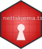

<!-- README.md is generated from README.Rmd. Please edit that file -->

# nettskjema.tsd <a href="https://lcbc-uio.github.io/nettskjema.tsd/"></a>

<!-- badges: start -->

[](https://github.com/Athanasiamo/nettskjema.tsd/actions/workflows/R-CMD-check.yaml)
[](https://CRAN.R-project.org/package=nettskjema.tsd)
[](https://lifecycle.r-lib.org/articles/stages.html#experimental)
<!-- [](https://r-pkg.org/pkg/nettskjema.tsd) -->
<!-- badges: end -->

Working with Nettskjema (<https://nettskjema.no/>) data inside TSD can
be challenging. This package aims to aid users in managing their
incoming Nettskjema data by decrypting the data and storing the
nettskjema data and meta-data in convenient and standardised ways. This
package functionality currently only works on the Linux VMs of TSD, and
for version 1 of the nettskjema data delivery to TSD.

## Installation

Install the package from the LCBC R-universe:

``` r
# Enable universe(s) by lcbc-uio
options(repos = c(
  lcbcuio = 'https://lcbc-uio.r-universe.dev',
  CRAN = 'https://cloud.r-project.org'))

# Install some packages
install.packages('nettskjema.tsd')
```

OR using the the package remotes to install.

``` r
# install.packages("remotes")
remotes::install_github("lcbc-uio/questionnaires")
```

## Caveats

-   Examples on how to use nettskjema.tsd outside TSD is difficult, as
    it is specifically created to work on nettskjema data within TSD.
-   It also only works on the linux VMs, not on the windows VMs of TSD.
    This has to do with how the file systems are treated differently
    between linux and windows machines on TSD.
-   The package also only deals with the first version of nettskjema
    data on TSD that relies on working with delivered files. Second
    version uses internal databases to deal with incoming data. We are
    working on getting this fixed.

## Example

``` r
library(nettskjema.tsd)
#> You are not on a Linux computer.
#>  Some functions from this package may not work as intended.FALSE
#> You are not on linux TSD.
#>  Some functions from this package may not work as intended.FALSE
## basic example code
```

## Code of Conduct

Please note that the nettskjema.tsd project is released with a
[Contributor Code of
Conduct](https://athanasiamo.github.io/nettskjema.tsd/CODE_OF_CONDUCT.html).
By contributing to this project, you agree to abide by its terms.

## Dev description

Documentation of the package is in progress, at its core it:

-   auto-detects gpg password by searching in default areas
-   decrypts new files as they have come in
-   copy files over to a new specified location
-   merges submissions into a single file for csv, it checks for header
    compatibility between submissions, so even if the form has changed,
    this should not break.
-   for json, it uses the meta-data accompanying a form to make sure
    column names are correct, also should not break if form changes.
-   Moves all form attachments into an attachments folder
-   if an edits-xxx.json file exists, will apply the edits specified in
    the file to the data and output a new csv file appended with ed.

The package is still in development and has some messy code for now.
